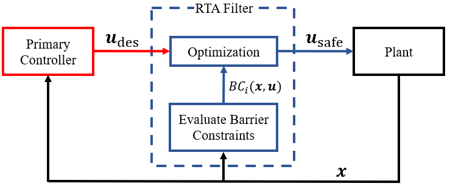

# ASIF RTA Filters

[Active Set Invariance Filter](http://www.ames.caltech.edu/gurriet2018online.pdf) (ASIF) RTA approaches are an optimization-based approach to assuring safety. ASIF approaches solve a qudratic program to minimize the $l^2$ norm difference between $\boldsymbol{u}_{\rm des}$ and $\boldsymbol{u}_{\rm safe}$, where safety is enforced using [control barrier functions](https://arxiv.org/pdf/1903.11199.pdf). This allows the ASIF to be minimally invasive towards the primary controller. For this module, the ASIF RTA is designed as follows,

$$
\begin{split}
\boldsymbol{u}_{\text{safe}}(\boldsymbol{x})=\underset{\boldsymbol{u} \in \mathcal{U}}{\text{argmin}} & \Vert \boldsymbol{u}_{\text{des}}-\boldsymbol{u}\Vert ^{2} \\
\text{s.t.} \quad & BC_i(\boldsymbol{x},\boldsymbol{u})\geq 0, \quad \forall i \in \{1,...,M\}
\end{split}
$$

Here, $BC_i(\boldsymbol{x},\boldsymbol{u})$ represents one of $M$ barrier constraints, where the barrier constraints are satisfied when $BC_i(\boldsymbol{x},\boldsymbol{u}) \geq 0$. The objective for using barrier constraints is to enforce Nagumo's condition, where the boundary of the set formed by $h_i(\boldsymbol{x})$ is examined to ensure $\dot{h}_i(\boldsymbol{x})$ is never decreasing, and therefore $\boldsymbol{x}$ will never leave $\mathcal{C}_{\rm S}$. For the $i^{th}$ safety constraint, this condition is written as,

$$
    \dot{h}_i(\boldsymbol{x}) = \nabla h_i(\boldsymbol{x}) \dot{\boldsymbol{x}} = L_f h_i(\boldsymbol{x}) + L_g h_i (\boldsymbol{x}) \boldsymbol{u} \geq 0,
$$

where $L_f$ and $L_g$ are Lie derivatives of $h_i$ along $f$ and $g$ respectively. In practice, this condition should only  be applied to the boundary of $\mathcal{C}_{\rm S}$, and not to states far from the boundary. To account for this fact, a strengthening function $\alpha(x)$ is used to relax the constraint away from the boundary. $\alpha(x)$ is a class-$\kappa$ function that is strictly increasing and meets the condition $\alpha(0)=0$. The barrier constraint is then constructed as,

$$
    BC_i(\boldsymbol{x},\boldsymbol{u}) := L_f h_i(\boldsymbol{x}) + L_g h_i (\boldsymbol{x}) \boldsymbol{u} + \alpha(h_i(\boldsymbol{x})).
$$

## Control System with ASIF RTA

A general control system with a ASIF RTA filter is shown in the figure below, where "Optimization" refers to solving the quadratic program.

## Slack Variables

When working with systems with multiple constraints, conflicts between the constraints could cause the quadratic program to fail to find a solution. In this case, slack variables, $\delta_i$, can be introduced to relax specific constraints and allow minimal violations such that $\boldsymbol{u}_{\text{safe}}$ can be computed. The ASIF RTA is modified as follows,

$$
    \begin{split}
    {\boldsymbol{u}}_{\rm safe}({\boldsymbol{x}}) = \underset{\boldsymbol{u} \in \mathcal{U}, \delta \in \mathbb{R}}{\text{argmin}} \Vert {\boldsymbol{u}}_{\rm des} - {\boldsymbol{u}} \Vert ^2 + \sum_i^M p_i\delta_i^2 \\
    \text{s.t. } \quad BC_i({\boldsymbol{x}}, {\boldsymbol{u}}) \geq \delta_i, \forall i\in \{1,..., M \}
    \end{split}
$$

where $p_i$ is a weight associated with each constraint / slack variable pair, and can be used to indicate priority of the constraint. As the objective of optimization is to minimize $\sum_i^M p_i\delta_i^2$, all slack variables should be zero until a constraint must be violated.
