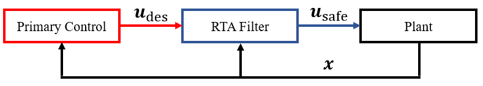

# Introduction

Run Time Assurance (RTA) is an online safety assurance technique that filters potentially unsafe inputs from a primary controller in a way that preserves safety of the system when necessary [[1]](https://etd.ohiolink.edu/apexprod/rws_etd/send_file/send?accession=ucin1649768916078616&disposition=inline). RTA is designed to be completely independent of the primary control structure, such that it can be used with any control system.

## Modeling Dynamical Control Systems

This module supports dynamical control systems, where $\boldsymbol{x} \in \mathcal{X} \subseteq \mathbb{R}^n$ denotes the state vector of size $n$ and $\boldsymbol{u}\in \mathcal{U} \subseteq\mathbb{R}^m$ denotes the control vector of size $m$. Here, $\mathcal{X}$ is a set defining all possible state values for the system, and $\mathcal{U}$ is a set of all admissible controls for the system, which is determined by the actuation constraints of the real world system. Assuming control affine dynamics, a continuous-time system model is given by a system of ordinary differential equations where,
$$
   \boldsymbol{\dot{x}} = f(\boldsymbol{x}) + g(\boldsymbol{x})\boldsymbol{u}.
$$

## Control System with RTA

A general control system with RTA is shown in the figure below.

In this figure, components outlined in red have low safety confidence while components outlined in blue have high safety confidence. At each time interval, the primary controller, which can be a variety of systems such as a neural network or human operator, is given the state $\boldsymbol{x}$ and outputs a desired action $\boldsymbol{u}_{\rm des}$. The RTA filter then receives $\boldsymbol{x}$ and $\boldsymbol{u}_{\rm des}$ as inputs, intervenes as necessary to preserve safety of the system, and outputs a safe action $\boldsymbol{u}_{\rm safe}$. The plant then receives $\boldsymbol{u}_{\rm safe}$, integrates the state based on the dynamics, and passes an updated state back to the primary controller and RTA filter.
