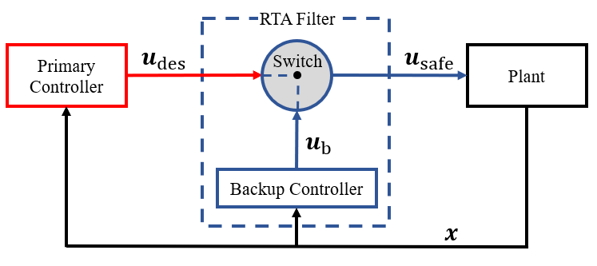

# Simplex RTA Filters

[Simplex](https://apps.dtic.mil/sti/pdfs/ADA307890.pdf) RTA filters switch between the primary controller and a verified backup controller to assure safety of the system. The Simplex filter montiors the desired control input $\boldsymbol{u}_{\rm des}$ from the primary controller, and if $\boldsymbol{u}_{\rm des}$ is determined to be safe, it is passed to the plant unaltered. Otherwise, a safe backup control input $\boldsymbol{u}_{\rm b}$ is instead passed to the plant. For this module, the Simplex RTA filter is designed as follows,

$$
\begin{array}{rl}
\boldsymbol{u}_{\rm safe}(\boldsymbol{x})=
\begin{cases}
\boldsymbol{u}_{\rm des}(\boldsymbol{x}) & {\rm if}\quad \phi_1^{\boldsymbol{u}_{\rm des}}(\boldsymbol{x}) \in \mathcal{C}_{\rm S}  \\
\boldsymbol{u}_{\rm b}(\boldsymbol{x})  & {\rm if}\quad otherwise
\end{cases}
\end{array}
$$

Here, $\phi_1^{\boldsymbol{u}_{\rm des}}(\boldsymbol{x})$ represents a prediction of the state $\boldsymbol{x}$ if $\boldsymbol{u}_{\rm des}$ is applied for one discrete time interval $\tau \in \mathcal{T}$.

## Control System with Simplex RTA

A general control system with a simplex RTA filter is shown in the figure below.

